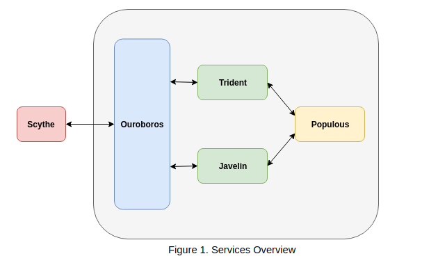
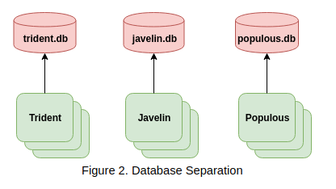

# Arch
Our system uses a single service for the web frontend, and the backend is split into multiple services based on domain. All network requests from the frontend, Scythe, pass through the API Gateway, Ouroboros. Ouroboros handles authentication and authorization, along with providing other middleware,  for HTTP requests and sends off tasks to appropriate microservices to return data to the frontend.

Requests related to ticket functionality are routed to Javelin, our ticket service, while tickets related to GAPF functionality are routed to Trident, our GAPF service. Both of these services are dependent on Populous, our applicant and faculty service.

#### Thrift
Instead of using REST endpoints, our internal backend services will communicate using Apache Thrift - which uses RPC (Remote Procedure Call).  Because of we're using RPC, we get some more type safety when using our endpoints. Thrift additionally provides tools for converting our endpoint specification into easy-to-use server and client code. In the future, using Thrift would allow us to switch our protocol and transports in cases such as JSON/HTTP to binary.

#### Scythe
The frontend service, Scythe, uses React and Redux for displaying views and managing state. We plan on keeping the frontend relatively simple

#### Library Dependencies
| Library | Description | 
| ------------- | ------------- | 
| [React](https://reactjs.org/)  | Framework used for creating reusable frontend views.
| [Reux](https://redux.js.org/)  | Framework used for maintaining state on the frontend services. 
| [Flow](https://flow.org/) | Static type checker for JavaScript.
| [ESLint](https://eslint.org/) |  Used for automatic linting in JavaScript code.
| [Express](https://expressjs.com/) | A minimal web framework that builds on Nodejs.
| [Thrift](https://www.npmjs.com/package/thrift) | The version of Thrift for Node.

#### Containers and Orchestration

In order to improve fault-tolerance in our distributed system and allow easy deployments, we use [Docker](https://www.docker.com/) for containerizing our services and [Kubernetes](https://kubernetes.io/) as our container orchestration software. Containers allow us to easily abstract our production environment from the host system. We specify how a service will be organized using a single configuration file, and then that service can be run on any hardware that has [Docker](https://www.docker.com/). In comparison to using virtual machines, containers are extremely lightweight, which allows them to be deleted and created in minutes instead of hours. In case something goes wrong with a deployment, we can simply destroy and container and recreate the container on another machine.

We simplify container orchestration by using Kubernetes to manage our deployments and service organization. Kubernetes reduces the overhead related to DevOps tasks by automatically deleting and re-deploying containers to match a specific configuration. In the case that one of the containers run into an error (e.g., it runs out of memory), Kubernetes will handle shutting down that container and re-deploying a new container for the impacted service. Kubernetes also manages important tasks such as service discovery, incremental rollouts, storage orchestration, and load balancing.

#### Google Cloud Platform

Our product is managed on the Google Cloud Platform [Kubernetes Engine](https://cloud.google.com/kubernetes-engine/). Google Cloud Platform provides the best support for Kubernetes, because Google created - and primarily maintains - Kubernetes. The platform provides additional functionality such as logging and monitoring. This simplifies our development a lot, because we don't need to integrate services like [Zipkin](https://zipkin.io/) for performing distributed tracing or [Grafana](https://grafana.com/) for monitoring. 

#### Databases

Each service has its own database. This bounds the context and domain of each service. In order to retrieve data, all services must communicate with each other over networks. This allows service owners to update their internal data models without compromising on the guarantees they provide service users.

Each of the services will use a [MongoDB](https://www.mongodb.com/) database.

#### Considered Alternatives

##### gRPC
[gRPC](https://grpc.io/) is another RPC system that we considered as an alternative to Thrift. gRPC uses [Protocol Buffers](https://developers.google.com/protocol-buffers/) as the default encoding for data instead of JSON/HTTP, while providing other useful functionality for data-intensive applications. This includes the ability to performing bi-directional streaming. While gRPC is a strong tool, it didn't have default supported libraries for Javascript and made tools like curl more difficult to use due to the default option of using Protocol Buffers as the underlying transport structure.

##### Golang
We initially considered Golang because of its strong type system, good performance, and language features that support working with networks. Because most of the team was not familiar with Golang, we opted to use Javascript instead.

##### GraphQL
[GraphQL](http://graphql.org/learn/) was an alternative for structuring our endpoints on our API gateway. Instead of using a REST format for the API gateway, we would use graph structures. GraphQL allows the client to define what they want to receive from an endpoint, instead of the response being defined by the server. The data transferred over the wire is meant to be a subset of all data, while allowing the client to define the data they want stops cases of over-fetching and under-fetching. Over-fetching results in more data than we actually need, while under-fetching results in additional (expensive) network calls. GraphQL is a significant advantage in high-latency and low bandwidth environments, because you can receive compact data in a single network request (vs. making multiple HTTP calls). On the downside, caching data on the client side becomes harder with GraphQL. We didn't use GraphQL because our application wouldn't be under high-latency and low bandwidth constraints, and because using GraphQL would present a larger learning curve.

##### Cassandra
[Cassandra](http://cassandra.apache.org/) provides high availability guarantees and high write throughput. It normally works well in distributed systems, but we don't need the high write throughput that Cassandra provides.

